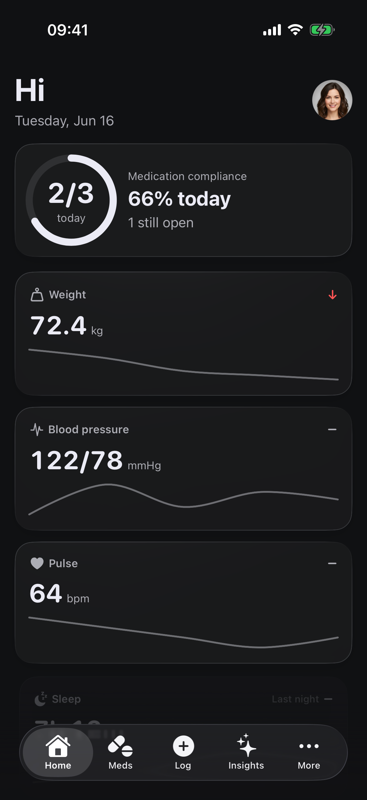
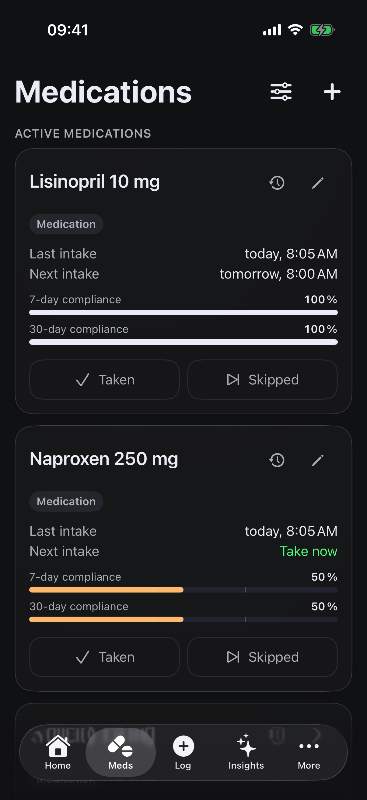
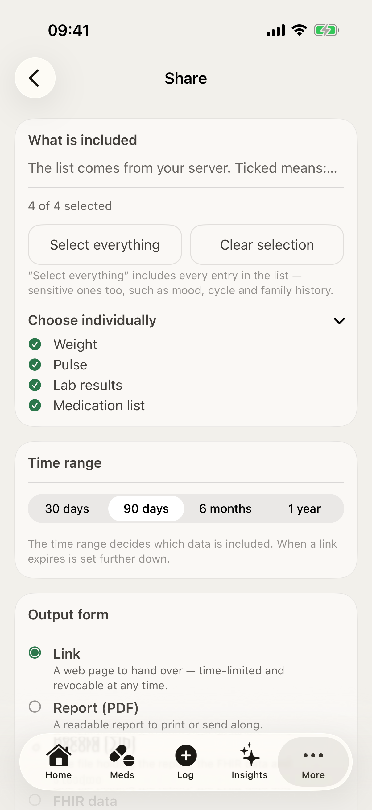

<h1 align="center">HealthLog iOS</h1>

<p align="center">
  Native iOS client for the <a href="https://github.com/MBombeck/HealthLog">HealthLog</a> self-hosted health-tracking platform — <a href="https://healthlog.dev/">healthlog.dev</a>.
</p>

<p align="center">
  <strong>Your health on your iPhone. Your data on your server.</strong>
</p>

<p align="center">
  <a href="LICENSE"></a>
  <a href="https://testflight.apple.com/join/bucuTBpa"></a>
  
  
  <a href="https://github.com/MBombeck/HealthLog"></a>
</p>

<p align="center">
  <a href="https://healthlog.dev/">Website</a> &middot;
  <a href="https://github.com/MBombeck/HealthLog">Server project</a> &middot;
  <a href="https://demo.healthlog.dev">Live demo server</a> &middot;
  <a href="https://docs.healthlog.dev">Documentation</a>
</p>

---

<p align="center">
  
  
  
</p>

## What it is

HealthLog iOS is the native iOS surface for the [HealthLog server](https://github.com/MBombeck/HealthLog) — the self-hosted personal health tracker that runs from a single `docker compose up`. The app does the things a phone is best at: capture a reading without opening a laptop, surface a calm at-a-glance home screen, push HealthKit data into your own server, deliver medication reminders that actually fire, and let you ask the AI Coach about your numbers from anywhere.

Every reading you log on iOS lands in the same Postgres your web UI reads. The iOS client is one more surface on the same data — never a parallel silo, never a cloud middleman. There is deliberately **no built-in server and no default host**: on first launch you point the app at your own instance, and until you do (or if you choose standalone mode, which runs entirely without a server) nothing leaves the device.

**For the full experience you need the [HealthLog server](https://github.com/MBombeck/HealthLog) running somewhere reachable** — homelab, NAS, small VPS. Don't have one yet? Point the first-launch step at `demo.healthlog.dev` and take it for a spin first.

## Getting the app

There are two ways in, and they carry the same code:

1. **Build from source** — this repository, instructions below. Free, no account needed beyond what Apple requires for device installs.
2. **TestFlight** — the newest build, always free: [testflight.apple.com/join/bucuTBpa](https://testflight.apple.com/join/bucuTBpa).

## Try it in two minutes

1. **Install** the [TestFlight build](https://testflight.apple.com/join/bucuTBpa).
2. **Open** the app. The first screen asks for your server URL.
3. **Point** it at `https://demo.healthlog.dev` (or your own install).
4. **Sign in** with the credentials shown on the demo server's landing page — or with your own Passkey if you already have a HealthLog account.

## Features

- **Calm dashboard.** Health Score ring up top, then your vitals at a glance: blood pressure, pulse, weight, steps, mood, glucose, sleep. Today's medication compliance sits inline on the dashboard instead of screaming from an alert banner.
- **One-tap capture.** A central "+" sheet for every metric the server tracks, plus quick-entry surfaces that get out of your way.
- **HealthKit two-way sync.** Today's step count reads live from HealthKit; the rest syncs in both directions with an external-UUID anti-duplicate scheme so the server and HealthKit never echo each other. Background refresh keeps the picture current while you sleep. A cluster filter lets you opt families out of sync.
- **Medications that nag without annoying.** Schedules including weekly and cyclic regimens, intake history with retro-mutate, a 14-day glyph track per medication, Live Activities for due doses, and notification action buttons that hit the server's mark-intake endpoint directly — no app launch needed. GLP-1 medications additionally get pharmacokinetic level curves, titration ladders, injection-site tracking, and a side-effects logbook.
- **Charts that mean something.** Per-metric drill-down with linear or logarithmic axis, time-range picker, reference-range bands from ESC/ESH and ADA, and full VoiceOver chart descriptors.
- **Insights and the Coach.** Health Score breakdown, correlation cards, a daily briefing, and a conversational AI Coach. On iOS 26 Apple-Intelligence-eligible iPhones the Coach runs **fully on-device** via Apple's FoundationModels — no prompt or response leaves the device. Alternatively, bring your own provider key (Anthropic, OpenAI, Google Gemini, or any OpenAI-compatible endpoint): requests go straight from your device to your provider, and the key lives in your Keychain. Every AI feature is opt-in behind an explicit consent step.
- **Apple Watch companion + widgets.** Watch app with complications, home-screen and lock-screen widgets, App Intents / Shortcuts ("Did I take my medication?"), and Spotlight indexing of your medications.
- **Doctor-report export.** A FHIR-flavoured PDF bundle for your physician, based on the LOINC mappings reviewed in the server's clinician surface.
- **Standalone mode.** No server yet? The app can run purely on-device and sync to your own instance later.

English is the primary language; German is fully supported. The [CHANGELOG](CHANGELOG.md) tracks releases.

## What syncs from HealthKit

| Metric family | Direction | Notes |
| --- | --- | --- |
| Steps, active energy, walking distance, flights climbed | HK → server | Today's value reads live from HealthKit; historical days from the server cache. |
| Body mass, body fat, BMI, height | HK ↔ server | Bi-directional. iOS writes carry `HKMetadataKeyExternalUUID = measurement.id` so re-reads dedup cleanly. |
| Blood pressure, heart rate, HRV, resting HR, SpO₂, blood glucose | HK ↔ server | Same anti-duplicate pattern. The server is canonical for entries you typed; HealthKit for entries a device captured. |
| Workouts incl. heart-rate samples and GPS routes | HK → server | Delivered as workout bundles. |
| Mood, medication intake, notes | Server only | Not standardised in HealthKit. iOS and web both write directly to the server. |

## Authentication, briefly

First launch asks for your server URL — there is no default; the app ships without a built-in server. After you connect, you sign in with **email and password** or with **a Passkey** if you built the app under your own bundle id with your host in the `webcredentials:` associated domain (see [docs/self-hosting.md](docs/self-hosting.md)). Tokens refresh in the background; the app never asks you to reauthenticate during normal use.

## Requirements

- **iPhone running iOS 18.0 or later.** The on-device AI Coach needs an Apple-Intelligence-eligible device on iOS 26; everything else runs on any iOS 18 iPhone. The Watch app needs watchOS 11.
- **A reachable [HealthLog server](https://github.com/MBombeck/HealthLog)** — your own install or `demo.healthlog.dev` for a test drive — or standalone mode.
- **For building from source:** a Mac with Xcode 26.6 (the pinned toolchain — see `project.yml` and CI), [XcodeGen](https://github.com/yonaskolb/XcodeGen), and an Apple Developer account for device installs. Simulator builds need no team.

## How it works

```
SwiftUI Views
    ↓
@MainActor @Observable Stores
    ↓
Repositories (stale-while-revalidate + Outbox)
    ↓
Actor-based Services  (APIClient, HealthKit, Passkey, Notifications)
    ↓
Codable + Sendable Models
```

Strict-concurrency Swift 6 throughout. The Outbox queues every write under network failure into a local SwiftData store and replays on the next reachable foreground; idempotency keys ride every POST and persist with the queued payload so retries are safe.

`HealthLogCore` is an internal SPM library defined in [`Package.swift`](Package.swift) — the platform-independent Models, APIClient, Keychain, Logger, Repositories, Sync and Pharmacokinetics layers. `swift build` compiles it iOS-free, which doubles as an architecture gate: core code cannot silently grow UIKit or HealthKit dependencies.

A deeper dive lives under [`docs/`](docs/) — architecture, security, API contract, and the decision log carry the *why* for the load-bearing choices.

## Build from source

The repository does not commit `HealthLog.xcodeproj` — it is regenerated from `project.yml` via [XcodeGen](https://github.com/yonaskolb/XcodeGen). (The SwiftPM lockfile inside the workspace *is* tracked, so dependency resolution is pinned.)

```bash
brew install xcodegen swiftlint swiftformat

git clone https://github.com/MBombeck/healthlog-iOS.git
cd healthlog-iOS

# For device builds: set DEVELOPMENT_TEAM in project.yml to your own team ID.
# Simulator builds work without it.

xcodegen
open HealthLog.xcodeproj    # scheme: HealthLog
```

The platform-independent core also builds without Xcode:

```bash
swift build    # compiles HealthLogCore
```

Quality gates the project holds itself to (and CI enforces): `swiftlint` and `swiftformat --lint` clean, `xcodebuild build` with warnings as errors, and the test suite green — see [TESTING.md](TESTING.md) for the concrete commands and the simulator baseline.

**Certificate pinning is opt-in and operator-owned.** The repository ships no pins and no pinned host — there is no built-in server, so there is nothing to pin by default. A build without pinning validates via system trust, which is the normal state. If you want pinning, passkeys, or universal links in your own build, provide the Info.plist keys `CertificatePinner` reads (`HLPinnedHosts`, `HLPinnedSPKIHashes`, `HLPasskeyRelyingPartyHosts`) in your own build configuration; `scripts/extract-spki.sh` computes the SPKI hashes for your host, and a release build crashes early on a *half* configuration — hashes without hosts or vice versa — because both look like pinning and are none. `Config/local.example.yml` documents the shape of such an overlay.

## Project layout

```
├── HealthLog/                  # iOS app target
│   ├── App/                    # Entry point, AuthenticatedShell, RootView
│   ├── Cache/                  # SwiftData-backed snapshots + invalidator
│   ├── DesignSystem/           # HLCard, HLText, HLSpace, HLRing, …
│   ├── FHIR/                   # SpeziFHIR mapping for doctor-report export
│   ├── Intents/                # App Intents / Shortcuts
│   ├── LiveActivity/           # Medication Live Activities
│   ├── Models/                 # Codable + Sendable domain types
│   ├── Pharmacokinetics/       # GLP-1 level modelling (EMA-parameterised)
│   ├── Repositories/           # SWR + Outbox network glue
│   ├── Screens/                # SwiftUI screen surfaces
│   ├── Services/               # APIClient, Keychain, HealthKit, Passkey, AI/
│   ├── Standalone/             # Server-less local mode
│   ├── Stores/                 # @MainActor @Observable view-models
│   └── Sync/                   # BackgroundSyncCoordinator + cluster filter
├── HealthLogWatch/             # watchOS companion app
├── HealthLogWidgets/           # Home/lock-screen widgets
├── HealthLogTests/             # Swift Testing + SnapshotTesting
├── HealthLogUITests/           # XCUITest journeys
├── docs/                       # Architecture, security, API contract, ADRs
├── scripts/                    # Lint/i18n gates, SPKI extractor, contract checks
├── Package.swift               # HealthLogCore SPM library definition
└── project.yml                 # XcodeGen source-of-truth
```

## Acknowledgements

This app is built on [Stanford Spezi](https://github.com/StanfordSpezi) ([spezi.stanford.edu](https://spezi.stanford.edu)), the open-source digital-health framework from Stanford's Biodesign Digital Health group — and it deserves loud credit: sixteen Spezi packages carry HealthLog's HealthKit integration, FHIR mapping, LLM plumbing, Bluetooth device support, scheduling, onboarding, storage, and more, plus four packages from the sibling [StanfordBDHG](https://github.com/StanfordBDHG) org (HealthKitOnFHIR among them). Spezi supported this project enormously; if you build health software for Apple platforms, look at it first.

Beyond the Spezi ecosystem, HealthLog iOS stands on: Apple's [FHIRModels](https://github.com/apple/FHIRModels) and the [swift-openapi](https://github.com/apple/swift-openapi-generator) stack, [MLX Swift](https://github.com/ml-explore/mlx-swift) for on-device inference, [swift-markdown-ui](https://github.com/gonzalezreal/swift-markdown-ui), [Pow](https://github.com/EmergeTools/Pow), [SQLite.swift](https://github.com/stephencelis/SQLite.swift), Point-Free's [swift-snapshot-testing](https://github.com/pointfreeco/swift-snapshot-testing), and a number of further community packages pinned in the tracked `Package.resolved`. All dependencies arrive via Swift Package Manager under their own licenses; nothing is vendored into this tree.

## Feedback · bug reports · contributions

The most useful things you can do:

- **Run the app** against your own server (or `demo.healthlog.dev`) and tell me where it breaks.
- **Open an [issue](https://github.com/MBombeck/healthlog-iOS/issues)** with the build number from **More → About**, one line on what you tried, one line on what happened vs. what you expected, a screenshot if it's visual, and whether it reproduces.
- **Suggest what's missing.** The roadmap is driven by what real self-hosters actually reach for.
- **Pull requests** are welcome for small fixes and tests. For larger work please open an issue first so we don't duplicate effort. Working with AI tooling is fine — see [CONTRIBUTING-AI.md](CONTRIBUTING-AI.md) for the ground rules.

If you find a **security issue**, please disclose responsibly via the [server project's security channel](https://github.com/MBombeck/HealthLog/security) rather than a public issue.

## License

HealthLog iOS is licensed under the [PolyForm Noncommercial License 1.0.0](LICENSE) — the same license as the [server project](https://github.com/MBombeck/HealthLog). It is free to use, build, and modify for noncommercial purposes; commercial use requires a separate agreement.

---

<p align="center">
  <a href="https://healthlog.dev/">Website</a> &middot;
  <a href="https://testflight.apple.com/join/bucuTBpa">TestFlight</a> &middot;
  <a href="https://github.com/MBombeck/HealthLog">Server project</a> &middot;
  <a href="https://demo.healthlog.dev">Live demo</a> &middot;
  <a href="https://github.com/MBombeck/healthlog-iOS/issues">Issues</a>
</p>
