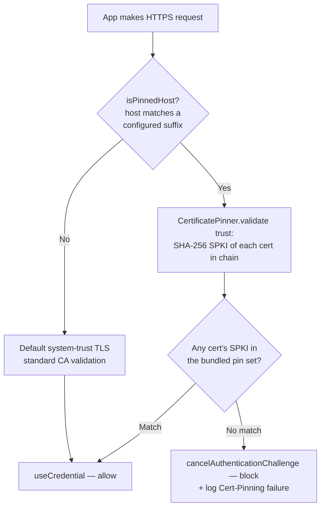

# Security

## Data at Rest

- **Tokens, Server-URL, HK-Anchors:** Keychain mit `kSecAttrAccessibleAfterFirstUnlockThisDeviceOnly`.
- **Keine Tokens** in `UserDefaults`, `NSCache`, oder Plaintext-Files.
- **SwiftData-Caches** sind nicht-sensitiv (UI-Schicht); enthalten aber pseudonymisierte Health-Daten — daher Default-Filesystem-Encryption (auf iOS Standard) reicht.

## Data in Transit

> **Korrektur, 2026-08-25 (Legibility-Sweep, Phase 23).** Das unten beschriebene `HL_LOCAL_CONFIG`-Overlay ist **derzeit nicht verdrahtet**. Commit `04130697` (*"fix(release): keep distributed builds operator-neutral"*, 2026-08-12) hat den Block `include: { path: Config/local.yml, enable: ${HL_LOCAL_CONFIG} }` aus `project.yml` entfernt, zusammen mit dem automatischen Export im Release-Skript. `project.yml` enthaelt heute gar kein `include:` mehr — `HL_LOCAL_CONFIG=1 xcodegen` bewirkt also **nichts**, und `Config/local.yml` wird nie gelesen. Verteilte Builds sind damit per Konstruktion betreiberneutral. Fuer diese Korrektur wurde nichts neu verdrahtet: der Mechanismus wurde gemessen, nicht wiederhergestellt. Wer Pinning, Passkeys oder Universal Links im eigenen Build braucht, setzt die Info.plist-Schluessel selbst, die `CertificatePinner` liest.

- **App Transport Security:** strict, kein `NSAllowsArbitraryLoads`, keine Exception-Domains.
- **Certificate Pinning** optional, ueber SPKI-Hash (Public-Key-Pin, nicht Cert-Hash).
- **Wo die Pins liegen:** nicht im Repository. Hashes, gepinnte Hosts und die
  Associated Domains sind betreiber-eigene Angaben und stehen im lokalen,
  gitignorierten `Config/local.yml` (Vorlage `Config/local.example.yml`), das
  XcodeGen nur mit `HL_LOCAL_CONFIG=1` einzieht. Ein Build ohne Overlay pinnt
  nicht und validiert per System-Trust — der gueltige Normalzustand.
- Empfohlenes Pin-Set: **CA-Level** — Intermediate (GTS WE1) + Root (GTS Root R4) SPKI-Hashes.
  Der Leaf wird seit #122 bewusst **nicht** gepinnt: GTS rollt bei jedem ~90-d-Renewal
  einen frischen Leaf-Keypair, ein Leaf-Pin wuerde also pro Renewal einen App-Release
  erzwingen. Routine-Leaf-Renewals brauchen **keinen Build**.
- Build-Time-Guard (`AppContainer.init` / `IntentDependencies.resolve`, jeweils `!DEBUG`):
  **kein** Crash, wenn gar kein Pinning konfiguriert ist. Crash nur, wenn ein Build
  Pinning *deklariert* (Hosts und/oder Hashes) und es unvollstaendig mitbringt —
  Hashes ohne Hosts (greift nie), Hosts ohne Hashes (schuetzt nie), weniger als
  `CertificatePinner.minimumProductionPinCount` (= 2) Pins, oder ein Pin, der nicht
  zu 32 Bytes SHA-256 dekodiert. Regel: `CertificatePinner.pinConfigurationIsValid`,
  Test-Mirror in `CertificatePinnerTests`.

### Certificate pinning explained

> Plain-language background for the runbook below — and for self-hosters wondering whether
> pinning blocks them (it doesn't; see
> [self-hosting.md → Certificate pinning & your own domain](self-hosting.md#certificate-pinning--your-own-domain)).

**What TLS cert pinning is.** Normally an app trusts *any* certificate that chains up to a
trusted Certificate Authority (CA) in the system trust store — the same model your browser
uses (see [Transport Layer Security](https://en.wikipedia.org/wiki/Transport_Layer_Security)
and [X.509](https://en.wikipedia.org/wiki/X.509)). That's good, but it means anyone who can
get a *valid* certificate for our domain — a mis-issuing CA, a corporate TLS-intercepting
proxy, a compromised CA — can sit in the middle and read traffic. **Certificate pinning**
narrows the trust: the app additionally requires that the server's certificate match a known,
hardcoded fingerprint. Anything else is refused, even if it's CA-valid. This is the standard
mitigation against a
[man-in-the-middle (MITM) attack](https://en.wikipedia.org/wiki/Man-in-the-middle_attack)
on TLS. (The general idea was once standardized as
[HTTP Public Key Pinning](https://en.wikipedia.org/wiki/HTTP_Public_Key_Pinning) for
browsers; that HTTP header is deprecated, but app-side public-key pinning like ours remains
common and sound.)

**Why SPKI (public-key) pinning, not cert-hash pinning.** We pin the
[public-key fingerprint](https://en.wikipedia.org/wiki/Public_key_fingerprint) — the SHA-256
of the certificate's **SubjectPublicKeyInfo (SPKI)** structure — not the hash of the whole
certificate. The difference matters at rotation time: a CA can re-issue a *new certificate*
that wraps the *same public key* (longer validity, new serial, new dates). If we pinned the
whole cert, that routine re-issue would break us; pinning the SPKI lets the same key survive
across multiple certificates. The SPKI hash is computed in
`HealthLog/Services/CertificatePinner.swift` (`validate(trust:)` walks the full chain via
`SecTrustCopyCertificateChain` and accepts the connection if **any** certificate in the chain
matches **any** pin in the set) and is bit-identical to what `scripts/extract-spki.sh` produces
with `openssl`.

**Host-scoping — pinning is deliberately narrow.** Pinning applies *only* to the apexes
configured in `HLPinnedHosts` (leer im eingecheckten Stand) and any of their subdomains. The check is the `isPinnedHost` predicate
in `HealthLog/Services/APIClient.swift`; for any other host the URL-session challenge handler
falls back to default system-trust TLS. This is intentional and has two consequences:

- An attacker cannot impersonate the managed cloud with a different (even CA-valid) key — the
  SPKI won't match the pinned set, so the handshake is cancelled.
- **Self-hosters are never locked out.** Their own domain isn't pinned, so the app validates it
  with the normal CA trust store, exactly like any HTTPS client. The same rule is honoured in
  Release and Debug, and by both the production session and the onboarding / "Change server"
  probe session, so the trust contract doesn't change depending on which session issues the
  request.



**The CA-pin rotation-survival strategy (#122 — shipped).** A leaf pin is fragile: Google
Trust Services renews the managed host's server cert every ~90 days and **rolls a fresh
keypair each time** (unlike Let's-Encrypt-style renewals that may reuse the key). A pinned
leaf therefore forced an app release per renewal — the old "2026-06-26 chore". Since #122 the
shipped pin set contains **only the two long-lived CA keys** (GTS WE1 intermediate + GTS Root
R4). Because `validate(trust:)` accepts a match *anywhere* in the chain, every routine leaf
renewal passes with **zero app update** while the chain is still proven to terminate in keys
we expect. The production gate `meetsProductionPinPolicy` requires **≥ 2 well-formed pins**
(`minimumProductionPinCount = 2`); the `AppContainer.init` precondition crashes a Release
build that ships fewer, so this can't regress silently.

**Accepted tradeoff (audit S3.2):** CA-level pinning is deliberately *weaker* than leaf
pinning — any GTS-WE1-issued certificate for a pinned host passes the pin (hostname
validation still applies via system trust, and the host-suffix label boundary blocks
look-alike domains that merely *end* in the same letters). That availability-over-strictness
tradeoff is intentional: a MITM still needs a cert chaining through GTS WE1 → GTS Root R4
**and** passing baseline X.509 evaluation for our exact hostname — i.e. a GTS mis-issuance
for the managed host itself.

### Pin rotation policy

| Pin role | Key | SPKI sha256/base64 | Source cert | Algorithm | Expires |
|---|---|---|---|---|---|
| CA-1 (intermediate) | Google Trust Services WE1 | `kIdp6NNEd8wsugYyyIYFsi1ylMCED3hZbSR8ZFsa/A4=` | `CN=WE1`, issued by GTS Root R4 | EC P-256 | **2029-02-20** |
| CA-2 (root) | Google Trust Services Root R4 | `mEflZT5enoR1FuXLgYYGqnVEoZvmf9c2bVBpiOjYQ0c=` | `CN=GTS Root R4` | EC P-384 | **2028-01-28** |

Der Leaf ist **nicht** gepinnt — Routine-Renewals (frueher der 2026-06-26-Termin) laufen
ohne Build durch. Ein Pin-Update wird erst noetig, wenn Google einen der beiden CA-Keys
dreht (selten, idR Jahre im Voraus angekuendigt) oder der Server zu einer anderen CA
wechselt. Naechste **harte** Deadline ist die Root-R4-Expiry **2028-01-28**.

**Hash-Extraktion** (live vom Server, ein Aufruf liefert die ganze Chain):

```bash
scripts/extract-spki.sh <managed-host>
```

Output (Beispiel — Leaf -> Intermediate -> Root, jeweils mit `notAfter` + Base64-SPKI-Hash;
**nur [2] + [3] sind gepinnt**, der Leaf [1] dient der Chain-Verifikation):

```
[1] subject=CN=<managed-host>      ← NICHT gepinnt (rotiert ~90 d, frischer Key)
    issuer=C=US, O=Google Trust Services, CN=WE1
    SPKI(SHA-256, b64): <wechselt pro Renewal>

[2] subject=C=US, O=Google Trust Services, CN=WE1
    ...
    SPKI(SHA-256, b64): kIdp6NNEd8wsugYyyIYFsi1ylMCED3hZbSR8ZFsa/A4=

[3] subject=C=US, O=Google Trust Services LLC, CN=GTS Root R4
    ...
    SPKI(SHA-256, b64): mEflZT5enoR1FuXLgYYGqnVEoZvmf9c2bVBpiOjYQ0c=
```

**Rotation runbook (CA-Pins — der Leaf braucht keins):**
1. **Routine-Leaf-Renewal (alle ~90 d):** kein Action-Item. Optionaler Sanity-Check nach
   einem Renewal: `scripts/extract-spki.sh <managed-host>` — Chain muss weiterhin in
   WE1 ([2]) + Root R4 ([3]) terminieren. Tut sie das nicht (CA-Wechsel!), → Schritt 3.
2. **Reminder-Termine (im Kalender):**
   - **2028-01-15** — GTS Root R4 laeuft 2028-01-28 ab. Bis dahin muss Google den
     Nachfolge-Root etabliert haben; neuen Root-Hash zusaetzlich pinnen (Schritt 3).
     Realistisch ab Q3 2027 beobachten.
   - **2029-01** — GTS WE1 laeuft 2029-02-20 ab; gleiche Prozedur fuer den Intermediate.
3. **CA-Rotation (Intermediate oder Root dreht / Server wechselt die CA):**
   a. Neue CA-Hashes **zusaetzlich** (nicht ersetzend) in `HLPinnedSPKIHashes`
      (`project.yml`) eintragen — In-Flight-Builds + App-Store-Reviewzeit akzeptieren
      weiter die alte Chain.
   b. `xcodegen`, dann `xcodebuild ... test -only-testing:CertificatePinnerTests` —
      gruen heisst: Set well-formed + `meetsProductionPinPolicy` erfuellt.
   c. Tag `vX.Y.Z-cert-rotation`, Release-Build, TestFlight, App Store Submit mit
      **≥ 4 Wochen Buffer** vor der Expiry des alten CA-Keys.
   d. Im naechsten Release nach der Umstellung: alte CA-Hashes entfernen
      (≥ 2 well-formed Pins muessen bleiben).

**Aktueller Stand (2026-06-11, v0.14.8 Tech-Audit S3.1):**
- Gepinntes Set steht seit P1 in `Config/local.yml` (nicht eingecheckt) → `Info.plist`
  `HLPinnedSPKIHashes`; beim Betreiber genau die zwei CA-Pins (WE1 + Root R4), letzte
  Live-Chain-Verifikation 2026-06-05 (v0.14.1) — bit-identisch. Der eingecheckte Stand
  bringt kein Pin-Set mit.
- Die frueher hier dokumentierte Deadline „Dual-Pin-Patch + TestFlight bis 2026-06-15
  (Leaf-Expiry 2026-06-26)" ist **obsolet** — der Leaf ist seit #122 nicht mehr gepinnt,
  sein Renewal ist ein Non-Event. Kein Emergency-Build noetig.
- Optionaler Check nach dem GTS-Renewal (~Mitte Juni 2026): einmal
  `scripts/extract-spki.sh <managed-host>` laufen lassen und bestaetigen, dass die
  neue Chain weiterhin in WE1/R4 terminiert.
- **Naechste harte Pin-Deadline: 2028-01-28 (Root R4).** Reminder: 2028-01-15 (hart),
  Beobachtung ab Q3 2027; WE1-Reminder 2029-01.

## Authentication

- **Passkey** als Primaer-Auth. WebAuthn ueber `ASAuthorizationController`.
- **Email+Passwort** Fallback. Passwort wird nie gespeichert; Token wird ausgetauscht.
- **Biometric-Lock** opt-in im Onboarding, default ON.
- **Re-Auth on 401**, max 1 Retry, dann Logout-Flow.

## Privacy

- **Privacy Manifest** (`PrivacyInfo.xcprivacy`) — required APIs deklarieren.
- **Privacy Nutrition Label** vorbereiten (Daten gesammelt: Health, identifiers; kein Tracking).
- **NSPrivacyTracking:** false. Keine Tracking-Domains.
- **Privacy-Strings** vollstaendig in Info.plist:
  - `NSHealthShareUsageDescription`
  - `NSHealthUpdateUsageDescription`
  - `NSFaceIDUsageDescription`
  - `NSUserNotificationsUsageDescription`

## Logging

- `Logger` aus `os.log`, Categories pro Subsystem (`HealthLog/Services/Logger.swift`).
- Production-Logs auf `info`+, **kein** `debug`-Output mit Request-Bodies.
- **API-Garantie:** `HLLog.*` exposed `HLLogger`, **nicht** direkt `os.Logger`. Jeder
  Log-Call laeuft beim Build der Message zwingend durch `LogSanitizer.redact()` —
  Call-Sites koennen die Redaktion nicht umgehen.
- Aktive Sanitizer-Regeln (Reihenfolge im Code: H-2/H-3/H-4 fixed, siehe
  `LogSanitizer.swift` Header):
  1. `Bearer <token>` → `[redacted-bearer]`
  2. URLs `https?://host[/path?query#frag]` → `https?://host` (nur Scheme + Host)
  3. Email-Adressen → `[redacted-email]`
  4. UUIDs (canonical 8-4-4-4-12, case-insensitive) → `[redacted-uuid]`
     (catched Idempotency-Keys, Request-IDs, etc.)
  5. Token-aehnliche Strings (≥32 alphanum/_-) → `[redacted-token]`

## Audit-Log

Jede der folgenden Aktionen wird lokal **und** serverseitig geloggt:
- HealthKit-Authorization-Aenderung (Read/Write)
- Server-Auth-Wechsel (Login, Logout, Token-Rotation)
- HK-Sync-Toggle
- Biometric-Lock-Aenderung
- Cert-Pinning-Failure (lokal, dann beim naechsten Connect serverseitig)

## Third-Party

- **Keine** 3rd-Party-Analytics. Keine Crashlytics, kein Sentry, kein Firebase.
- Crash-Reporting: MetricKit (Apple), opt-in Server-Upload.
- Snapshot-Tests-Lib (`pointfreeco/swift-snapshot-testing`): nur Test-Target, keine Distribution.

## Secrets im Repo

- Keine. Alle Build-Variablen ueber `xcconfig.local` (gitignored) oder CI-Secrets.
- `.env`-Files sind in `.gitignore`.

## Threat Model (Kurz)

| Threat | Mitigation |
|--------|------------|
| Stolen Device | Biometric-Lock, Token-Accessibility nach FirstUnlock |
| MITM | Cert-Pinning + ATS strict |
| Logs leaken Token | PII-Sanitizer + production-only `info`-level |
| Replay-Angriff (Schreibzugriff) | Idempotency-Key + Server-Side-Check |
| HK-Doppel-Sample | ExternalUUID-Filter + Server-Side Idempotency |
| App ueber-Berechtigt (HK) | Pro Datentyp Toggle, default minimal-set, User-driven Expansion |
