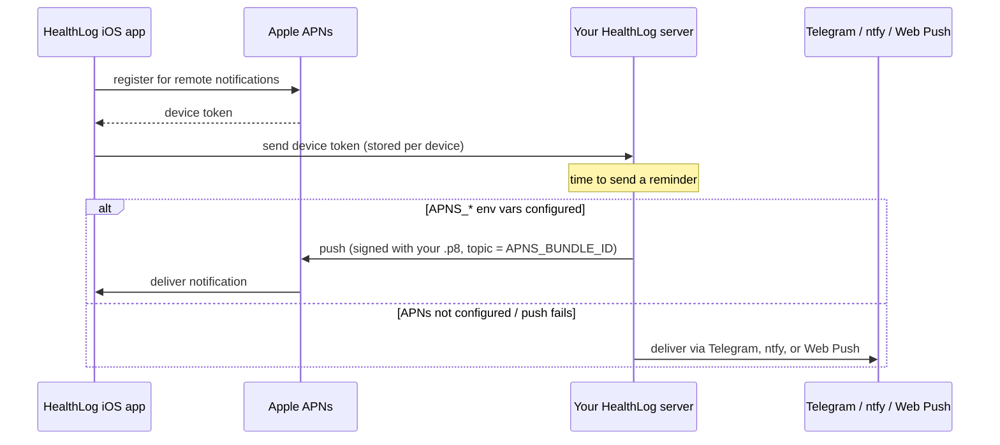
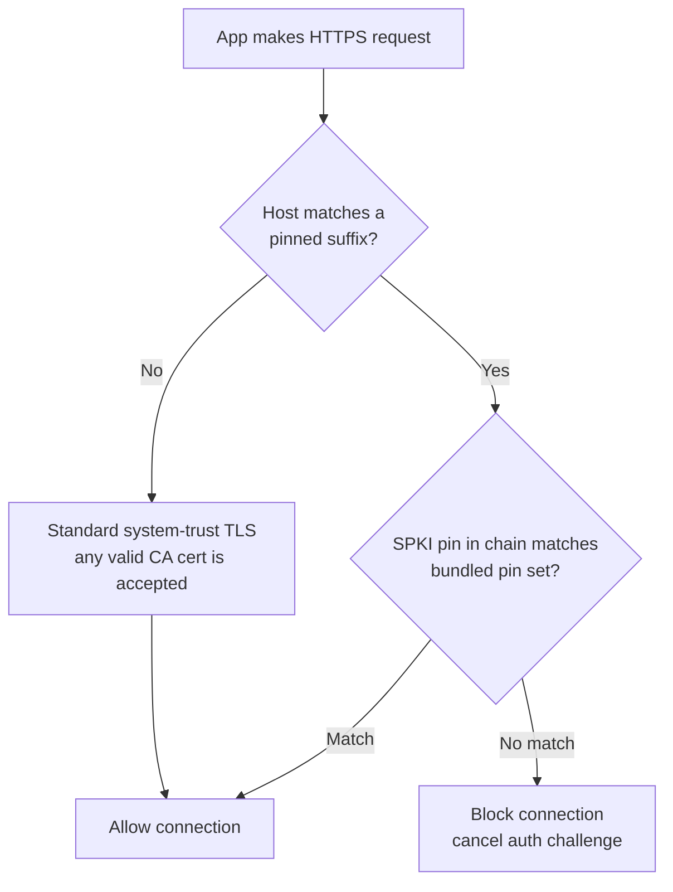

# Self-Hosting HealthLog

HealthLog is **server-first**: the iOS app is a client, and all your data, settings,
and AI configuration live on a server you control. There is a managed instance the app
ships with as its default host, but nothing stops you from running your own server and
pointing the app at it.

This guide explains the two topics that trip people up most when self-hosting:

1. **[Push notifications](#push-notifications--the-apns-p8-key)** — what APNs is, why the
   `.p8` key is needed *server-side*, and the (annoying but unavoidable) Apple constraint
   that forces you to rebuild the iOS app under your own bundle-id if you want push.
2. **[Certificate pinning](#certificate-pinning--your-own-domain)** — why pinning is off by
   default and never locks you out on your own domain.

If you only ever want to read this doc once: **push is optional, and pinning does not
block self-hosters.** The rest is the detail behind those two sentences.

---

## What self-hosting means

You run two things:

- **The HealthLog server** (a Node/TypeScript app, in its own repo). This holds your
  account, your measurements, your medication schedule, your settings, and your AI-provider
  config. You deploy it on your own host (Docker, Coolify, a VPS — your choice) behind a
  domain you own, e.g. `health.example.com`.
- **The HealthLog iOS app**, pointed at your server. On first launch (onboarding) you enter
  your server URL; you can also change it later under **Settings → Change server**. The app
  stores only what the server can't know: the auth token, HealthKit anchors, and a handful of
  UI preferences. Everything else is fetched from your server.

Authentication runs entirely against *your* server, so no third party is involved. Email +
password works out of the box.

**Passkeys need one extra step, and the app is honest about it.** iOS only allows a passkey
ceremony for a relying party that is covered by the app's `webcredentials:` associated domain,
and an associated domain is baked into the signed build. A plain clone ships none — so the
passkey button simply does not appear, instead of appearing and hanging forever
(that was GitHub issue #65). To turn passkeys on for your instance:

> **Correction, 2026-08-25 (Phase-23 legibility sweep).** `HL_LOCAL_CONFIG=1 xcodegen` has **no effect today**: commit `04130697` (2026-08-12) removed the `include:` for `Config/local.yml` from `project.yml`, which now carries no `include:` at all. The step below cannot do what it says. Nothing was re-wired for this correction.

1. Put your host into `HLPasskeyRelyingPartyHosts` **and** into
   `com.apple.developer.associated-domains` (as `webcredentials:<host>`, plus
   `applinks:<host>` if you want invite links to open the app) in `Config/local.yml` —
   see `Config/local.example.yml`.
2. Serve `https://<host>/.well-known/apple-app-site-association` with your appID
   (`<TEAMID>.<your-bundle-id>`).
3. Rebuild with `HL_LOCAL_CONFIG=1 xcodegen` under your own bundle-id.

Until then the app offers the web hand-off instead: sign-in happens in the browser on your
own origin, where your passkeys and password manager do work.

---

## Push notifications & the APNs `.p8` key

### What APNs is

[Apple Push Notification service (APNs)](https://en.wikipedia.org/wiki/Apple_Push_Notification_service)
is the only way to deliver a push notification to an iPhone. Your server cannot talk to the
device directly — it hands the notification to Apple, and Apple delivers it. To be allowed to
hand notifications to Apple, your server has to authenticate with a credential issued by an
Apple Developer account: an **APNs Auth Key**, which Apple gives you as a `.p8` file.

So the `.p8` lives **on the server**, not in the app. The app's only job is to register with
Apple, receive a *device token*, and send that token to your server. Your server then uses the
`.p8` to tell Apple "deliver this push to this device token."



### The hard Apple constraint

Here is the part that makes self-hosting push awkward, and it is **Apple's rule, not ours**:

- A `.p8` key is bound to a specific **Apple Developer account / Team**.
- Every push carries a **topic**, and the topic *must equal the app's bundle-id*. In our
  server code the topic is set straight from the `APNS_BUNDLE_ID` env var.
- Apple's APNs gateway checks that the `.p8`'s team actually owns the app that the bundle-id
  belongs to. If they don't line up, the push is rejected with `DeviceTokenNotForTopic` — a
  permanent failure.

The HealthLog iOS app ships with a fixed bundle-id, **`dev.healthlog.app`**, hardcoded in
`project.yml` (`PRODUCT_BUNDLE_IDENTIFIER`). That bundle-id belongs to *our* Apple team. You
cannot point your own `.p8` at the public app binary — the team won't match.

**Consequence:** to use your *own* `.p8`, you must rebuild and re-sign the iOS app under your
*own* bundle-id and your *own* Apple Developer team, and then set `APNS_BUNDLE_ID` on your
server to that same bundle-id. There is no env-var or runtime trick around this — the bundle-id
is baked in at build time, and Apple validates the team.

### Push is optional

Before you sigh at the rebuild: **you do not need push at all.** If you leave the `APNS_*`
env vars unset, the push channel is silently disabled and the app works completely — medication
logging, HealthKit sync, measurements, dashboard, insights, settings. The server simply routes
reminders through its fallback channels instead:

- **Telegram**
- **[ntfy](https://en.wikipedia.org/wiki/Ntfy)**
- **Web Push** (browser notifications)

So the honest decision tree is:

- *Just want a working app?* → don't configure APNs. Done. Use Telegram/ntfy/Web Push for
  reminders if you want them.
- *Want native iOS push specifically?* → rebuild under your own bundle-id + team, generate your
  own `.p8`, set the four env vars below.

### The four `APNS_*` env vars

The server reads APNs config purely from environment variables — nothing about our Apple account
is hardcoded server-side. You need all of:

| Variable | What it is |
|---|---|
| `APNS_KEY_ID` | The 10-character Key ID Apple shows when you create the APNs key |
| `APNS_TEAM_ID` | Your 10-character Apple Developer Team ID |
| `APNS_BUNDLE_ID` | Your app's bundle-id — **must match** the rebuilt app (the push topic) |
| `APNS_KEY` *(or `APNS_KEY_B64` / `APNS_KEY_FILE`)* | The `.p8` contents, in one of three forms |

For the key itself, pick whichever form is least painful for your deployment:

- `APNS_KEY` — the raw PEM contents of the `.p8` (multi-line, or with `\n`-escaped newlines).
- `APNS_KEY_B64` — the `.p8` base64-encoded with no newlines (easiest for most container env
  systems).
- `APNS_KEY_FILE` — a filesystem path to the mounted `.p8`.

If **any** of the four are missing, APNs stays off — it's all-or-nothing, and the app keeps
working via the fallback channels.

Example (`.env`):

```bash
APNS_KEY_ID="ABC123DEF4"
APNS_TEAM_ID="ABCDE12345"      # your Apple Developer team id
APNS_BUNDLE_ID="com.example.healthlog"
APNS_KEY_B64="LS0tLS1CRUdJTiBQUklWQVRFIEtFWS0tLS0t...=="   # base64 of your .p8, no newlines
```

### Checklist: self-hosted push

1. **Fork / clone** the HealthLog iOS repo.
2. **Change the bundle-id** in `project.yml` — set `PRODUCT_BUNDLE_IDENTIFIER` to your own
   reverse-DNS id, e.g. `com.example.healthlog`. Re-run `xcodegen`.
3. **Re-sign** the build with *your* Apple Developer team (your provisioning profile /
   signing identity).
4. **Create a `.p8`** in *your* Apple Developer account: developer.apple.com →
   Certificates, Identifiers & Profiles → **Keys** → create a new **APNs** key. Note the
   **Key ID** and your **Team ID**, and download the `.p8` (Apple only lets you download it once).
5. **Set the env vars** on your server (`APNS_KEY_ID`, `APNS_TEAM_ID`, `APNS_BUNDLE_ID` = your
   new bundle-id, and one of `APNS_KEY` / `APNS_KEY_B64` / `APNS_KEY_FILE`). Restart the server.
6. **Deploy** your rebuilt app (TestFlight or ad-hoc) and point it at your server.
7. **Verify**: the app registers and sends its device token; the server logs a successful APNs
   config load (no warnings); a test medication reminder arrives natively.

If push doesn't fire, the first thing to check is that `APNS_BUNDLE_ID` exactly equals the
bundle-id you built with — a mismatch is the classic `DeviceTokenNotForTopic` cause.

---

## Certificate pinning & your own domain

### The short version: you are not locked out

The app can do **TLS certificate pinning**, but the checked-in source pins **nothing**: there
is no built-in server and therefore no built-in host to pin. The pinned hosts are exactly the
suffixes in `HLPinnedHosts`, which come from a local, *not* checked-in operator overlay
(`Config/local.yml`). For every other host — i.e. every host, in a plain clone — the app falls
back to standard CA-validated TLS (the same trust your browser uses).

So if you self-host on `health.example.com`, the app sees a non-pinned host and validates your
server with the normal system trust store. **Your own domain is not pinned, and you are not
blocked.** You just need a valid TLS certificate from any trusted CA (Let's Encrypt, ZeroSSL,
your CA of choice — exactly what you'd set up for any HTTPS site).

The decision the app makes on every request:



This is implemented in `HealthLog/Services/APIClient.swift` (the `isPinnedHost` predicate and
the URL-session challenge handler) and `HealthLog/Services/CertificatePinner.swift` (the SPKI
match). The same rule applies in Release *and* Debug, and to both the production session and the
onboarding / "Change server" probe — so the trust contract is identical no matter how a request
is issued.

### Optional: pinning your own domain

You don't *need* to pin your own domain — standard TLS is already protecting you. But if you
want the extra hardening of pinning (defeating an attacker who somehow obtains a valid-but-rogue
cert for your domain), that's a build-time configuration:

> **Correction, 2026-08-25 (Phase-23 legibility sweep).** `HL_LOCAL_CONFIG=1 xcodegen` has **no effect today**: commit `04130697` (2026-08-12) removed the `include:` for `Config/local.yml` from `project.yml`, which now carries no `include:` at all. The step below cannot do what it says. Nothing was re-wired for this correction.

1. Copy `Config/local.example.yml` to `Config/local.yml` (it is gitignored — your host and
   your pins never end up in the repository).
2. Extract your domain's SPKI hashes:
   ```bash
   scripts/extract-spki.sh yourdomain.example
   ```
3. Put your host into `HLPinnedHosts` and your hashes into `HLPinnedSPKIHashes` — in **both**
   the `HealthLog` and the `HealthLogWidgets` block, the widget/Siri extension is a separate
   process with its own Info.plist. Then rebuild with `HL_LOCAL_CONFIG=1 xcodegen`.

   Half a configuration is refused on purpose: hashes without hosts would never be enforced,
   hosts without (at least two well-formed) hashes would either not protect you or lock you
   out at the next certificate rotation. A Release build trips a precondition in either case;
   *no* pinning configuration at all is fine and is the default.
4. Ship **at least two** pins (leaf + a backup such as the intermediate or root) so a routine
   certificate rotation doesn't lock your own app out. This is exactly the rotation-survival
   strategy described in the security doc.

The full mechanics — why SPKI rather than cert-hash pinning, the three-pin rotation strategy,
and the re-extraction runbook — live in
**[Certificate pinning explained](security.md#certificate-pinning-explained)**. Read that before
you pin anything, because a careless pin set is a great way to lock your *own* users out on the
next cert renewal.

---

## See also

- **[security.md → Certificate pinning explained](security.md#certificate-pinning-explained)** —
  the deep dive on pinning, SPKI, and the rotation runbook.
- **[apple-developer-setup.md](apple-developer-setup.md)** — bundle-id, App ID capabilities,
  provisioning, and the TestFlight pipeline (useful when you rebuild under your own team).
